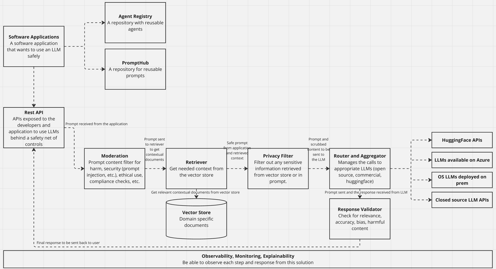
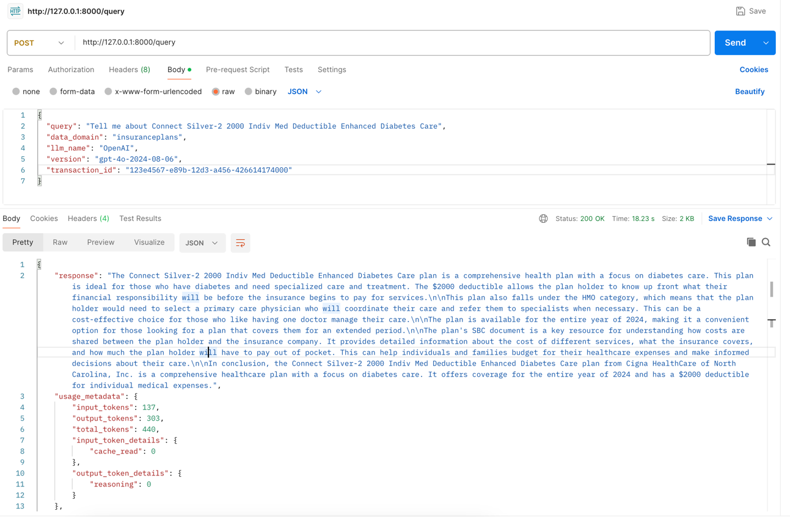
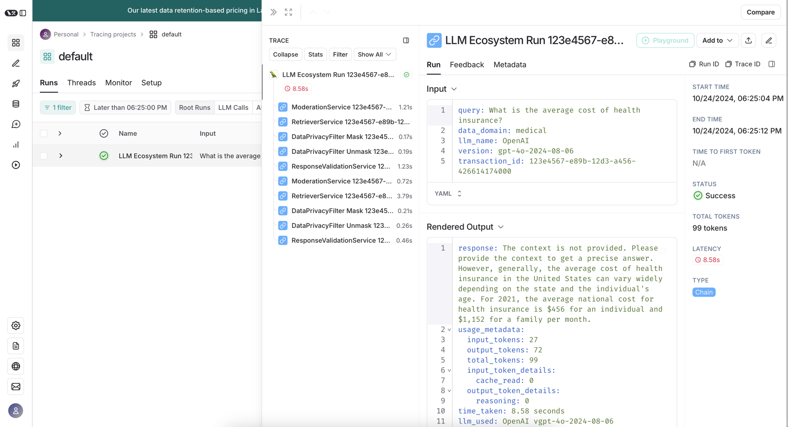

# Tempered LLM Service

At the peak of cloud adoption, enterprise spent effort to develop cloud foundational service that abstracted away complex crosscutting concerts away from the application development teams. Some of these cross curring concerns included - access management, monitoring, logging, cost management, etc.

This article talks about a similar approach to enterprise use of LLMs. Almost all development teams will need to write some protective wrappers around an LLM to manage security, compliance, context, etd. This is an opportunity to take this responsibility over from development teams. Enterprise can provide a wrapper service around an LLM. Subsequent sections talk about few concerns that such a wrapper can address. 

## Overview

The **LLM Query Service** is an API for interacting with Language Models (LLMs) and retrieving responses enriched with additional metrics. It handles input query moderation, sensitive data masking, retrieval of contextual information, response generation, and validation. The service is implemented using FastAPI and is designed to ensure privacy, security, and quality in LLM responses.


## Features

- **ModerationService**: Evaluates the safety and bias of the input query to prevent harmful or inappropriate content from being processed by the LLM.
- **RetrieverService**: Uses Pinecone and OpenAI embeddings to provide contextual data relevant to the input query.
- **LLMService**: Manages the connection to multiple LLMs, such as OpenAI and Anthropic's Claude, and selects the appropriate model and version for processing the query.
- **DataPrivacyFilter**: Masks sensitive data (e.g., SSNs, credit card numbers) before passing the query to the LLM and restores it afterward.
- **ResponseValidationService**: Checks the generated response for safety and bias before returning it to the user.
- **LangSmithRunManager**: Logs and monitors the processing steps for each query using LangSmith's run management API.

## Prerequisites

- Python 3.8+
- [FastAPI](https://fastapi.tiangolo.com/)
- [Pinecone](https://www.pinecone.io/)
- OpenAI API key (`OPENAI_API_KEY`)
- LangChain API key (`LANGCHAIN_API_KEY`)

## Installation

1. Clone the repository.

   ```bash
   git clone <repository-url>
   cd <repository-folder>
   ```

2. Install dependencies using `pip`:

   ```bash
   pip install -r requirements.txt
   ```

3. Set the required environment variables:

   - `OPENAI_API_KEY`: API key for OpenAI.
   - `LANGCHAIN_API_KEY`: API key for LangChain.
   - `PINECONE_API_KEY` : API key for pinecone

   You can set them in your terminal or add them to a `.env` file for easier access.

## Running the Service

Start the FastAPI application with the following command:

```bash
uvicorn main:app --reload
```

The service will be available at `https://127.0.0.1:8000/` by default.

## API Endpoint

### POST `/query`

This endpoint is used to send a query to an LLM for processing and retrieval of the response.

#### Request Body

```json
{
  "query": "What is the average cost of health insurance?",
  "data_domain": "medical",
  "llm_name": "OpenAI",
  "version": "gpt-4o-2024-08-06",
  "transaction_id": "123e4567-e89b-12d3-a456-426614174000"
}
```

- **`query`** (string, required): The input query to be processed by the LLM.
- **`data_domain`** (string, optional): Domain context for the query, such as "medical" or "legal".
- **`llm_name`** (string, required): The name of the LLM to use (e.g., "OpenAI", "Claude").
- **`version`** (string, required): The version of the LLM to use (e.g., "gpt-4o-2024-08-06").
- **`transaction_id`** (string, optional): Identifier for tracking requests; a new ID will be generated if not provided.

#### Response

```json
{
  "response": "This health plan is part of the Silver tier...",
  "usage_metadata": {
    "input_tokens": 171,
    "output_tokens": 250,
    "total_tokens": 421,
    "input_token_details": {
      "cache_read": 0
    },
    "output_token_details": {
      "reasoning": 0
    }
  },
  "time_taken": "18.81 seconds",
  "llm_used": "OpenAI v4o-2024-08-06",
  "safety_score": 1.0,
  "bias_score": 0.0,
  "feedback": "Content is safe.",
  "validation_result": {
    "is_harmful": false,
    "flagged_categories": {}
  }
}
```

- **`response`** (string): The response generated by the LLM.
- **`usage_metadata`** (object): Metadata related to token usage.
  - **`input_tokens`** (integer): Number of input tokens used.
  - **`output_tokens`** (integer): Number of output tokens generated.
  - **`total_tokens`** (integer): Total number of tokens used.
  - **`input_token_details`** and **`output_token_details`** (object): Details on token caching and reasoning.
- **`time_taken`** (string): Time taken to generate the response.
- **`llm_used`** (string): The LLM model and version used.
- **`safety_score`** and **`bias_score`** (number): Scores representing the safety and bias of the response.
- **`feedback`** (string): Feedback on the safety of the content.
- **`validation_result`** (object): Results of validation checks, including flagged categories.

## How It Works

1. **Moderation and Safety Check**: The input query is moderated using `ModerationService` to ensure it is safe to process.
2. **Retrieve Context**: The `RetrieverService` is used to obtain any relevant context for the query from a Pinecone database.
3. **Data Privacy**: Sensitive data in the query is masked using the `DataPrivacyFilter` before passing it to the LLM.
4. **LLM Invocation**: The masked query is then processed by an LLM chosen using `LLMService`.
5. **Response Validation**: The generated response is validated for relevance and safety using `ResponseValidationService`.
6. **Logging**: The entire process is logged using `LangSmithRunManager` to track each step and store metadata.

## Dependencies

- **FastAPI**: Web framework for building APIs.
- **LangChain**: LLM utility library.
- **Pinecone**: Vector database for storing embeddings and retrieving contextual information.
- **OpenAI**: Provides API for LLMs like GPT-4.

## Extending these basis capabilities

This is a very barebone implementation of the overall solution an enterprtise may need. Some extension (among many) are - image support, advanced RAG, compliance checks, cost management, authentication  

## License

This project is licensed under the MIT License.

## Contact

For any questions or support, please reach out to Dheeraj.r.hegde\@gmail.com.

## Output



